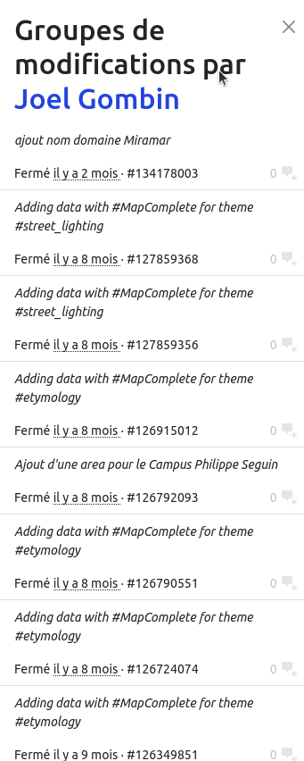
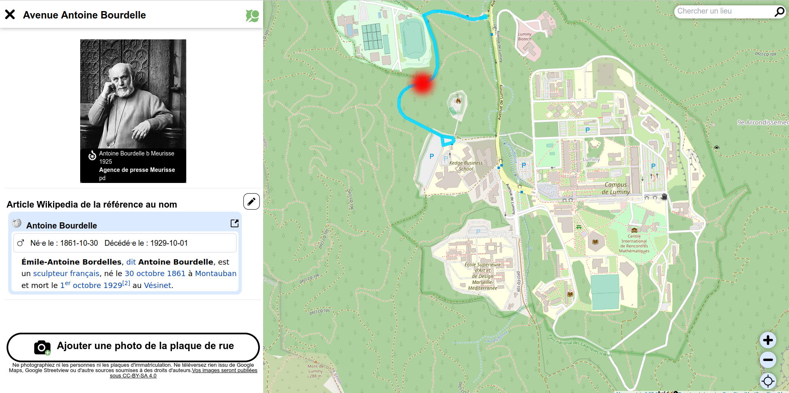
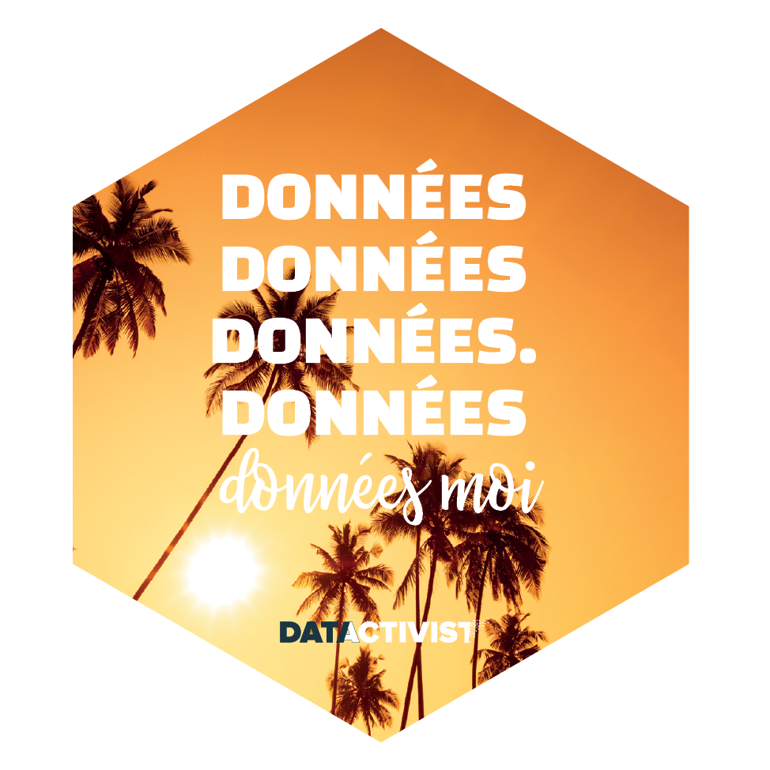
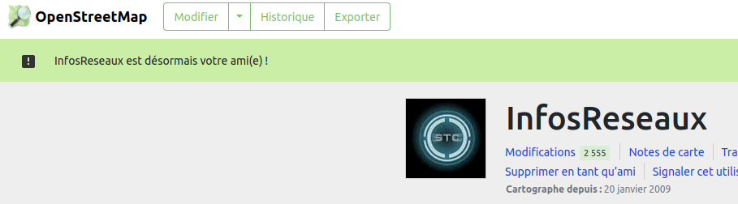

```{r, echo=FALSE}
library(metathis)
meta() %>% 
  meta_description(params$event) %>% 
  meta_name("github-repo" = paste0("datactivist/", params$slug)) %>% 
  meta_viewport() %>% 
  meta_social(
    title = params$title,
    url = paste0("https://datactivist.coop/", params$slug),
    image = params$image,
    image_alt = params$image_alt,
    og_type = "website",
    og_author = "Datactivist",
    og_locale = "fr_FR",
    og_site_name = "Datactivist",
    twitter_card_type = "summary",
    twitter_creator = "@datactivi_st")

```

layout: true

<style>
.remark-slide-number {
  position: inherit;
}

.remark-slide-number .progress-bar-container {
  position: absolute;
  bottom: 0;
  height: 4px;
  display: block;
  left: 0;
  right: 0;
}

.remark-slide-number .progress-bar {
  height: 100%;
  background-color: #e95459;
}

</style>


`r paste0("<div class='my-footer'><span>", params$event, "</span> <center><div class=logo><a href='https://datactivist.coop/'></a></div></center></span></div>")` 


---

class: center, middle

Ces slides en ligne : `r paste0("http://datactivist.coop/", params$slug)`

Sources : `r paste0("https://github.com/datactivist/", params$slug)`

Replay : https://peertube.openstreetmap.fr/w/3zBHp9q7SztLTkvD8g7D35

Les productions de Datactivist sont librement réutilisables selon les termes de la licence [Creative Commons 4.0 BY-SA](https://creativecommons.org/licenses/by-sa/4.0/legalcode.fr).

<BR>
<BR>


---

### Bienvenus en Provence !

.pull-left[


]
.pull-right[


]

---

### Je n'ai jamais été très doué pour les déclarations d'amour...

.center[

]

---

### Déjà, OSM, tu m'intimides...

.center[

]

???

J'ai une vraie fascination pour ce projet. J'en parle dans toutes mes formations/sensibilisations à l'open data, et ça fait systématiquement mouche. Il y a un vrai effet wahou, et au travers des différentes thématiques abordées, ça peut parler à tout le monde.  

Aussi, regardez ce que vous avez accompli ! OSM est LA  référence en matière de connaissance géographique du monde. 
Et vous y arrivez avec des moyens infiniment inférieurs à ceux de Google Maps, Apple Maps ou autre. 

De plus, l'idée que la contribution, la coopération et l'ouverture sont la clé pour une cartographie mondiale de haute qualité est aujourd'hui largement acceptée. La création d'Overture avec Meta, Amazon, Microsoft, Tom Tom, ESRI (!!!) en est la preuve. En France, l'évolution de l'IGN en est la preuve (en 2013, il y a 10 ans, le DG de l'IGN faisait des tribunes au vitriol dans la Gazette des communes contre OSM et Gaël Musquet...). Vous avez gagné !!

---

### Même si, parfois, tu manques de confiance en toi.

.center[

]

???

Tu te sens mal aimé(e)
Tu aimerais être hype, shiny, un popular kid
Tu aimerais que les gens qui te sont proches (les administrations publiques, la recherche) manifestent plus et mieux leur amour
Tu te dis que "c'est pas toi, c'est moi"

---

### Alors, OSM, haut les cœurs !

.center[


]

???

Joue de tes atouts !
Communique. Démontre. Convainc. 

---

### Car tu souffres peut-être du syndrome de Cyrano

.center[


]

???

Cyrano, trop bon camarade et manquant de confiance en lui, aide Christian à être aimée de la belle Roxane en lui écrivant et soufflant ses mots d'amour. Roxane comprendra, mais trop tard, qu'en fait c'était Cyrano qu'elle aimait à travers les mots prononcés par Christian... 

De même, tout le monde profite au quotidien d'OSM... mais généralement sans le savoir ! Vous êtes une infrastructure, le truc auquel personne ne pense jamais sauf quand c'est cassé (Susan Leigh Star, Geoffrey Bowker). Comme le souligne Star, "ce qui est infrastructure pour l’un est enjeu ou obstacle pour l’autre". 

On a d'ailleurs besoin d'enquêtes pour mettre en valeur OSM : cf. projet d'enquête du SOGA sur les communs de données dont OSM (Emmanuel Pierrat). 

---

### Alors, à quoi ça pourrait ressembler, "tits up" (ou "suit up") ?

.center[


]

???

par où on commence ? jusqu'où faut-il aller ? 


---

### Au commencement était la communauté

.center[


]

???

C'est la force d'OSM : sans communauté pas d'OSM !

Mais il faut capitaliser dessus. 

---

### Il faut en prendre soin, la soutenir, l'animer, l'élargir... 

.center[


]

???

Sortir de l'entre-soi n'est pas confortable. Mais ça peut créer des résultats remarquables !
Genre : d'autant plus nécessaire qu'on sait que les hommes et les femmes n'ont pas du tout le même rapport aux espaces publics par exemple 
Exemple de Wikimedia

---

### Les écosystèmes








???

Il faut multiplier les intersections et interactions avec d'autres milieux pour créer un écosystème le plus riche possible. 
Une surprise pour moi par exemple : les faibles relations avec le monde de la science ouverte (et pas seulement les géographes !)


---

### Les données

.center[
.reduite[



]
]

???

Votre force est la capacité à créer et développer de nouvelles sémantiques, créant une très grande versatilité. Vous avez intérêt à créer des alliances avec des acteurs "métiers" pour faire d'OSM la référence par défaut, adaptée aux métiers, qui seront ainsi plus incités à contribuer et à réutiliser. Ça suppose d'accroître la porosité de la communauté avec d'autres communautés...

Il faut aussi encourager les exports pré-mâchés pour des communautés pas expertes (OverPassTurbo n'est pas si facile) : les initiatives comme GeoDataMine ou OSM Data sont super (mais sans doute pas assez connues !). Egalement explorer d'autres interfaces ? Chatbot utilisant les possibilités des LLM pour créer et tester à la volée des requêtes OverPass ? 


---

### Les infrastructures

.center[



]


???

L'infra c'est le domaine de la friction. Il y en a encore pas mal...

Votre choix d'infrastructure presque distribué est pertinent. Mais peut-être faut-il le faciliter : partenariat avec AWS (ou autre) pour déployer des instances d'OSM, ou de uMap, and co, en one-click ? 


Les outils de contribution, qui sont aussi une infra, sont très nombreux et très bons chacun à leur manière, mais... on doit pouvoir faire plus simple, non ? La gamification est chouette mais elle mène jusqu'à un certain point seulement. Comment peut-on plus le lier aux usages (sur le modèle de Waze par ex) ? Les actes de contribuer et consommer sont trop dissociés. 


---

### Les organisations


.center[
.reduite[


]
]

???

Il y a besoin d'un (ou plusieurs) mode d'interface, de collaboration, avec des organisations (publiques ou privées). 

Le programme de Wikipédiens en résidence lancé par Wikimedia France est très inspirant.
La naissance de la fédération des professionnels d'OSM aussi. Mais à quand une asso des services publics pro-OSM ? Un programme pour les chercheurs et étudiants ? pour les entreprises (cf Enedis mais très ad hoc) ? 
Passera peut-être aussi par du business ? 

---
class: inverse, center, middle

# Merci !

Contact : [joel@datactivist.coop](mailto:joel@datactivist.coop)


